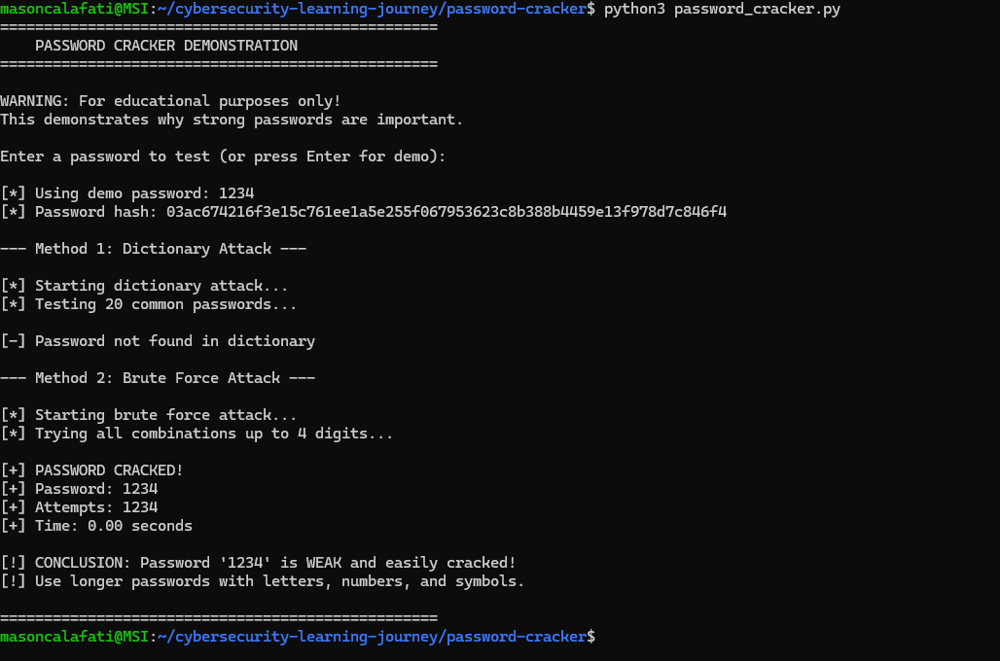

# Password Cracker Demonstration

Educational tool demonstrating password cracking techniques using dictionary attacks and brute force methods.

## Features
- SHA-256 password hashing
- Dictionary attack using common weak passwords
- Brute force attack for numeric passwords (up to 4 digits)
- Performance metrics (attempts, time elapsed)
- Security recommendations

## Demo


## Technical Skills Demonstrated
- Cryptographic hashing (SHA-256)
- Algorithm implementation (dictionary vs brute force)
- Time complexity analysis
- Security awareness and best practices

## Usage
```bash
python3 password_cracker.py
```

Test with weak passwords like "password" or "1234" to see how quickly they're cracked.

## Educational Purpose
Demonstrates why strong, complex passwords are essential for security.
